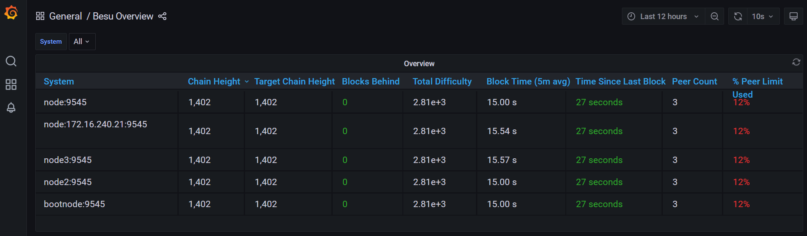
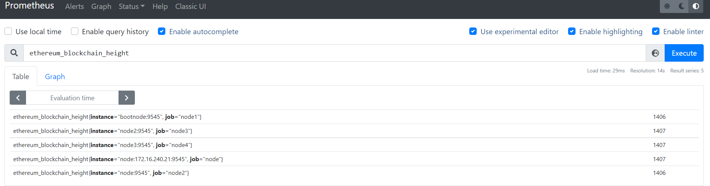
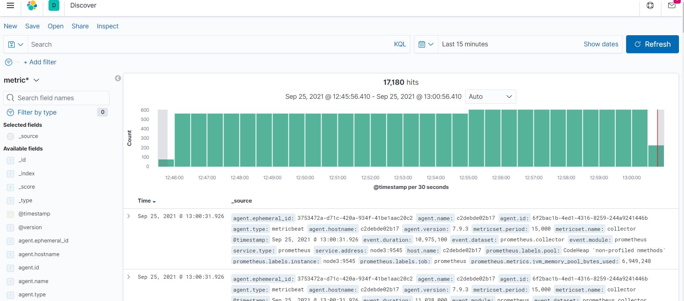
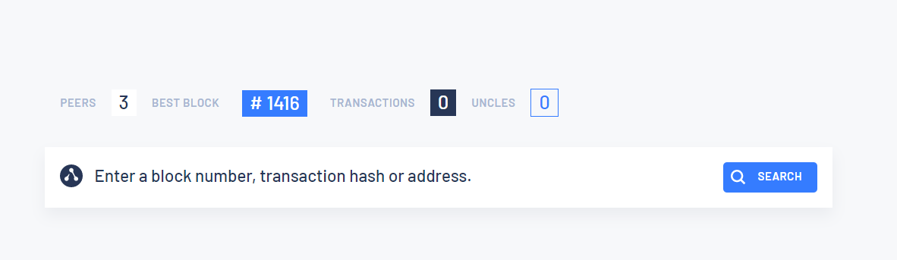
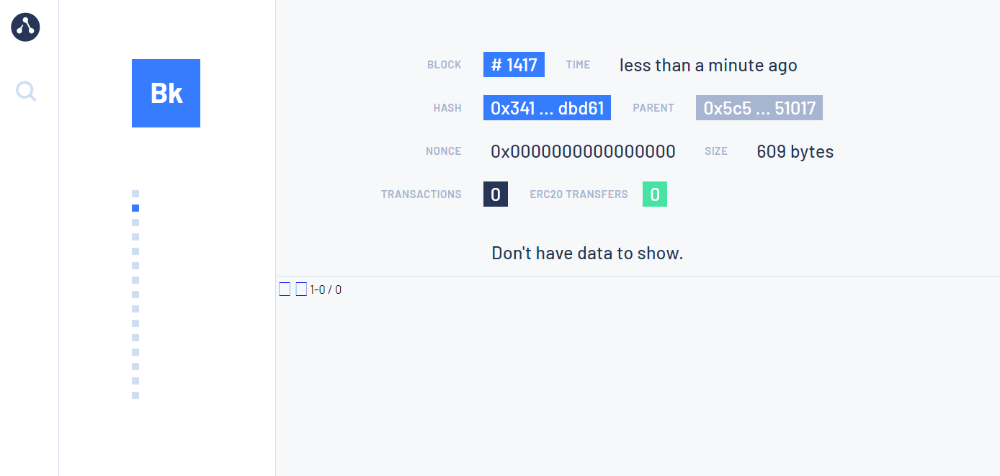
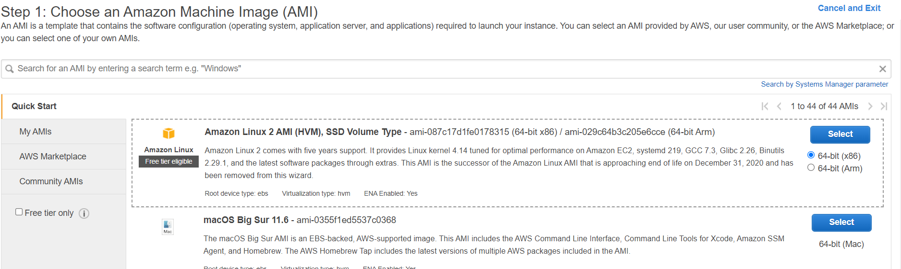
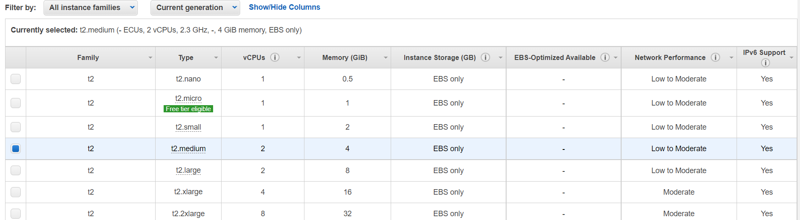
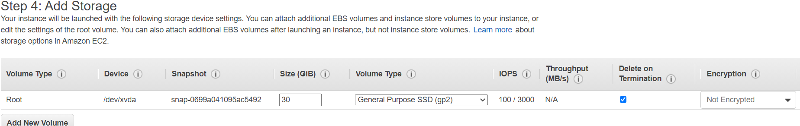
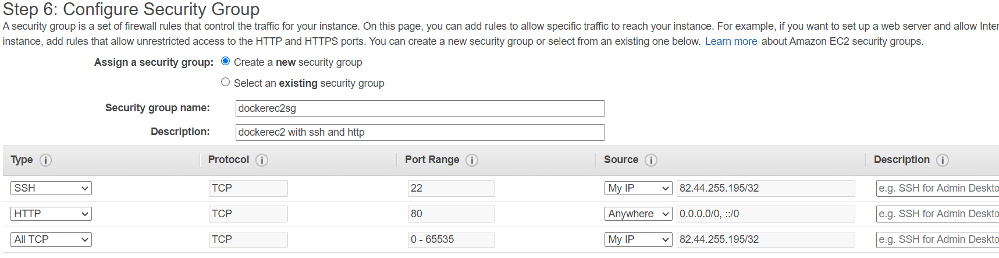
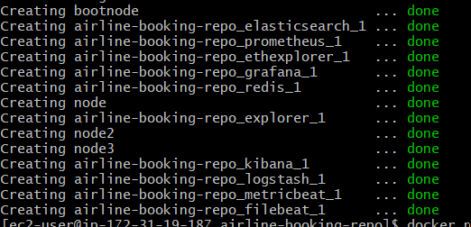

# Airline Ticket Booking Network

Eagle Airlines develop a unique blockchain-based ticket management system.

## Project structure

```
airline-booking-repo
    |-block-explorer
    |-elasticsearch
    |-filebeat
    |-logstash
    |-metricbeat
    |-node1
    |-node2
    |-node3
    |-node4
```

## Services used

1. Hyperledger-Besu nodes (node1-node4)
2. Grafana/Prometheus
   
   
   
3. ElasticSearch/Kibana
   
4. Block Explorer
   
   

## Installation instructions

### Local installation

Prerequisites : Git, Docker/docker-compose, node

Clone the repository

```
git clone https://github.com/Lrnd-Devops1/airline-booking-repo.git

```

Run docker compose to spin up the services in local

```
cd airline-booking-repo

docker-compose up -d
```

Verify the successful installation by navigating to grafana dashboard (http://localhost:3001) and see he data is display as the below screenshot


Once successful your network is ready to deploy contract.

### AWS Cloud installation

From AWS console choose EC2 nad create an instance as per the following configuration.

```
Note: Cloudformation template with ebs volume did't work as the AWS educate account has limited privileges
```

1. Select the "Amazon Linux 2 AMI"
   
2. Select t2.medium
   
3. Add storage - 30GB
   
4. Configure security group
   SSH with 22, HTTP with 80, All TCP with 0-65535
   
5. Launch the instance

Once the instance is up and running login to the instance from bash or putty and execute the following scripts to deploy the nodes

```bash
sudo yum update -y

sudo amazon-linux-extras install docker -y

sudo service docker start

sudo usermod -a -G docker ec2-user

sudo curl -L https://github.com/docker/compose/releases/latest/download/docker-compose-$(uname -s)-$(uname -m) -o /usr/local/bin/docker-compose

sudo yum install git

mkdir app

cd app
git clone https://github.com/Lrnd-Devops1/airline-booking-repo.git

sudo chmod +x /usr/local/bin/docker-compose

sudo usermod -aG docker ec2-user

newgrp docker

docker-compose up -d

```

Once successful should show the result as below


Try access the endpoints for metrics (replace localhost with ec2 instance public DNS or IP)

[Grafana](http://localhost:3001/d/XE4V0WGZz/besu-overview?orgId=1&refresh=10s)

[Prometheus](http://localhost:9090)

[Block explorer](http://localhost:25000/)

[KIbana](http://localhost:5601/)

## Connect the deployed network to Remix

Network Url : http://localhost:8545
ChainId: 1337

## Contract details

Files

1. Flight.sol (Flight and Ticket)
2. PlaneModel.sol (Plane model abstract contract, AirbusA320Neo and BoeingB737Max)

### Description

1. There are two main contracts: Flight and Ticket
2. Airline deploys a Flight contract for a particular scheduled flight.
3. Customer books a seat (a function in Flight contract), pays and gets a reference to the Ticket contract (deployed from the Flight contract), with a confirmation ID.
4. Customer related operations are done in the Ticket contract and Flight contract is updated.
5. Flight related operations are done in Flight contract by the Airlines.
